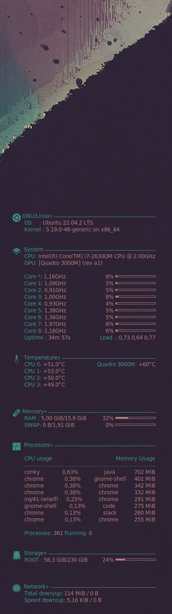

# Ubuntu 22.04 LTS - .conkyrc
My personal Conky configuration for Ubuntu 22.04 LTS

<p align="center"></p>

This repository contains the configuration file (`.conkyrc`) for Conky, a lightweight system monitor for Linux. The `.conkyrc` file provides the settings and customization options for Conky to display various system information on your desktop.

This configuration is my own fork of [Minimalis Conky 1.3](https://www.gnome-look.org/p/1112273/), optimized for my environment. Feel free to modify the configuration if needed!

## What is Conky?

Conky is a free, open-source system monitor for Linux. It can display a wide range of information on your desktop, including system statistics, CPU usage, memory usage, disk usage, network information, and much more. Conky is highly customizable, allowing users to tailor the appearance and content of the system monitor according to their preferences.

## Requirements

To use this Conky configuration, you need to have the following:

- Ubuntu 22.04 LTS (or a compatible Linux distribution)
- Conky installed on your system

## Installation

To install and set up Conky with this configuration file, follow these steps:

1. Clone this repository to your local machine:

```bash
git clone https://github.com/3liasP/ubuntu-conkyrc.git
```

2. Copy the `.conkyrc` file to your home directory:

```bash
cp ubuntu-conkyrc/.conkyrc ~/.conkyrc
```
3. Install icon font:
  - Download and extract: [ConkySymbols.ttf.tar.gz](https://github.com/Mic92/awesome-dotfiles/releases/tag/download)
  - Install the font to your system (in Ubuntu, simply by double-clicking the .ttf file) to render the icons

5. Launch Conky:

```bash
conky
```

4. Conky should now start and display the system information on your desktop. You can customize the appearance and content of Conky by modifying the `.conkyrc` file.

## Customization

The `.conkyrc` file contains various settings and options that you can customize to suit your needs. Some of the customizable aspects include:

- **Position**: You can adjust the position of the Conky window on your desktop.
- **Colors**: Modify the colors used for different elements of Conky, such as text, graphs, and borders.
- **Widgets**: Enable or disable specific system information widgets as per your preference.
- **Fonts**: Choose the fonts to be used for different sections of Conky.
- **Size**: Adjust the size and scale of Conky elements to fit your desktop layout.

Feel free to modify the `.conkyrc` file to meet your requirements. Refer to the Conky documentation for detailed instructions on customization options and syntax.

## Troubleshooting

If you encounter any issues or have questions regarding the usage or customization of this Conky configuration, please feel free to open an issue in this repository.

## License

This Conky configuration file is licensed under the [MIT License](https://opensource.org/licenses/MIT). You are free to use, modify, and distribute this file in accordance with the terms of the license.

## Acknowledgments

- The Conky development team for creating this excellent system monitor.
- Minimalis Conky 1.3 for a great Conky template
- ConkySymbols font for icons


Enjoy using Conky to monitor your system and have a great day!
